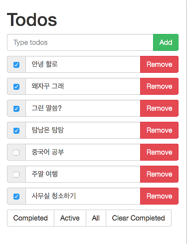

todomvc-angular
===============

## Index


## Preview



* 투두(Todo) 목록을 보여줌
* 추가, 편집, 삭제, 완료 처리할 수 있음 (CRUD)
* 투두의 상태에 따라 completed, active로 필터링 할 수 있음


## 프로젝트 구조

서버는 [Node.js](https://nodejs.org/en/)기반의 [Express.js](http://expressjs.com) 웹프레임웍을 사용함

서버는 1) html, css, javascript 등의 정적 파일을 제공하고 2) ajax 기능을 수행할 api를 제공함  

웹페이지는 [Angular.js](https://angularjs.org)를 사용한 하나의 페이지(index.html)로 구성됨

앵귤러 컨트롤러로 웹페이지를 조작하고 앵귤러 서비스를 통해 백엔드 api와 통신함


이미지 출처: [https://scotch.io/tutorials/creating-a-single-page-todo-app-with-node-and-angular](https://scotch.io/tutorials/creating-a-single-page-todo-app-with-node-and-angular)


## 개발환경 구성

### 노드 설치

* [https://nodejs.org/en/](https://nodejs.org/en/)에서 다운로드 후 설치
* 설치 확인:

```
$ node --version
$ which node
```

* 간단한 노드 스크립트 확인:

```
> console.log('hello world!')
hello world!

> var name = 'Chris'
> name
'Chris'
```

```
> const name = 'Chris'
> name
'Chris'

> name = 'Mars'
'Mars'

> name
'Chris'
```

### NPM

* Node Package Manager
* 노드 패키지를 프로젝트에 추가, 삭제하거나 만든 패키지를 배포할 때 사용함.
* 본 프로젝트에서는
  * angularjs등 외부 라이브러리를 설치하고
  * 노드 서버를 구동하는데 사용함
* 노드를 설치하면 자동으로 NPM도 설치됨
* 설치확인:

```
$ npm --version
$ which npm
```

*  NPM으로 프로젝트 생성:

```
$ npm init
```

### Gulp

https://github.com/gulpjs/gulp

```
$ npm install gulp-cli -g
$ npm install gulp --save-dev
$ cat gulpfile.js
```

gulpfile.js

```javascript
const gulp = require('gulp');

gulp.task('default', function () {
  console.log('default task');
});
```

```
$ gulp
default task
```

### Browser-sync

https://www.browsersync.io/docs/gulp

```
$ npm install browser-sync --save-dev
```

gulpfile.js:

```javascript
const gulp = require('gulp');
const browserSync = require('browser-sync');

gulp.task('client-watch', browserSync.reload);

gulp.task('serve', function (){
  browserSync.init({
    server: {
      baseDir: './client'
    }
  });

  gulp.watch('./client/**/*.*', ['client-watch'])
});

gulp.task('default', ['serve']);
```


### Nodemon

https://www.npmjs.com/package/gulp-nodemon

```
$ npm install gulp-nodemon --save-dev
```

gruntfile.js:

```javascript
const gulp = require('gulp');
const browserSync = require('browser-sync');
const nodemon = require('gulp-nodemon');

gulp.task('nodemon', function (cb) {
  var started= false;
  nodemon({
    script: 'server/app.js',
    ext: 'js',
    env: {
      'NODE_ENV': 'development'
    },
    watch: ['./server']
  }).on('start', function (){
    if (!started) {
      cb();
      started = true;
    }
  }).on('restart', function () {
    setTimeout(function () {
      console.log('server restarted')
      browserSync.reload();
    });
  });
});

gulp.task('browser-sync', ['nodemon'], function (){
  browserSync.init({
    files: ['./client/**/*.*'],
    proxy: 'localhost:3000',
    port: 4000
  });

  gulp.watch('./client/**/*.*', browserSync.reload)
});

gulp.task('default', ['browser-sync']);
```


